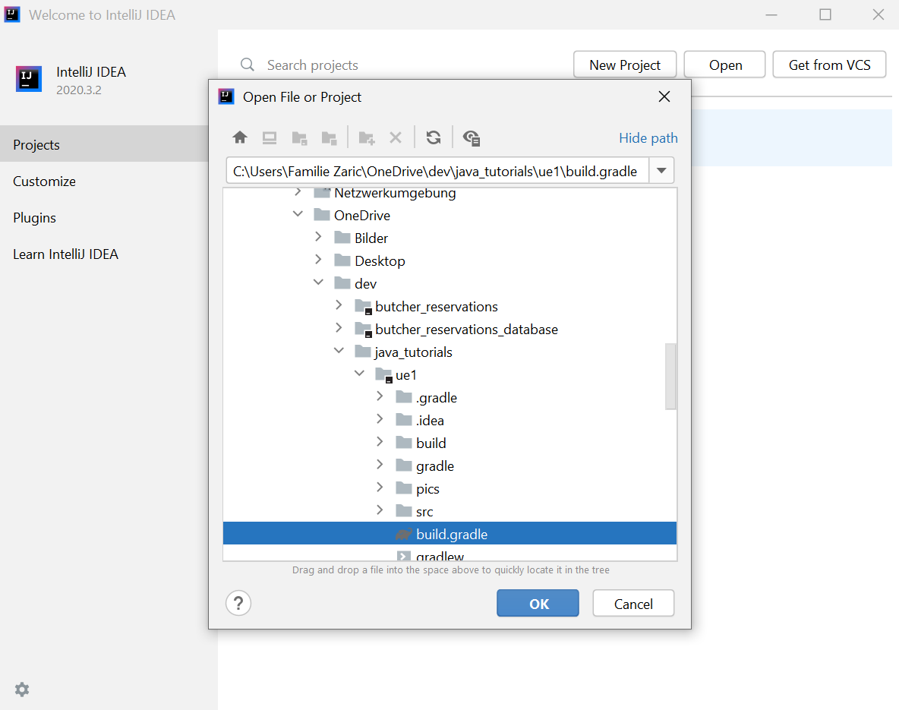
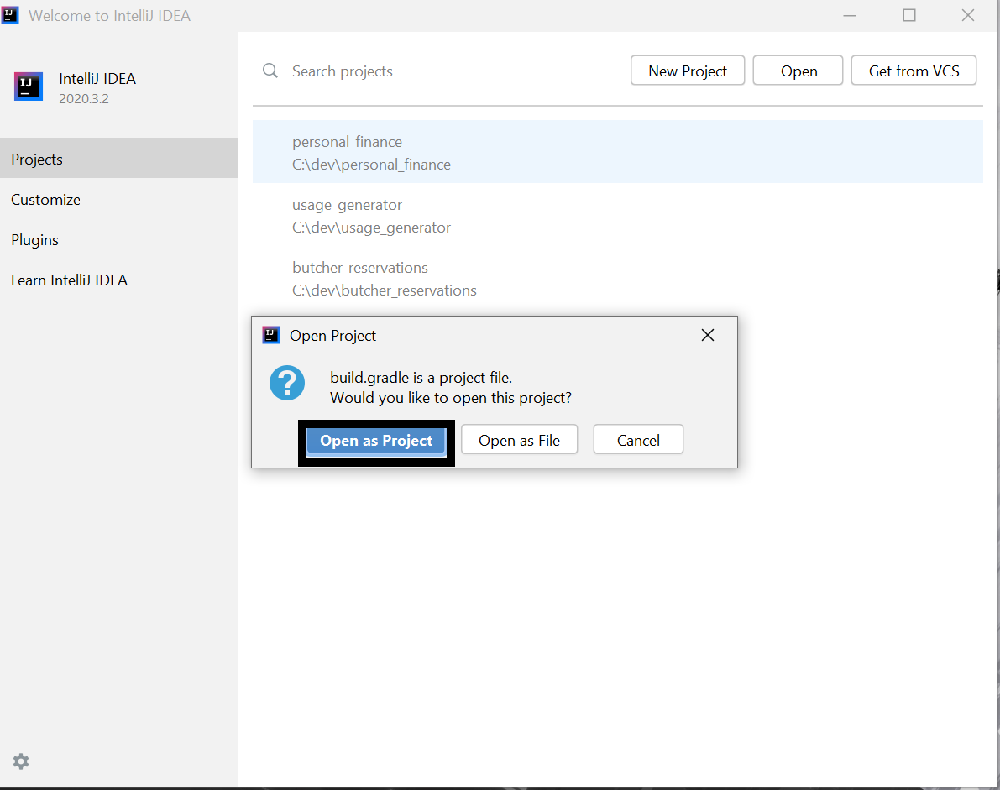

# java_tutorials
Tutorials for coding beginners

# Getting Started
To get started simple clone the repository to a location of your liking with: 
```
git clone https://github.com/z1230601/java_tutorials.git
```
* Navigate to this folder and go to the desired UE you want to do.
* Open your intellij.

* Select Open.
* Select the file named "build.gradle" from the ue you want to do

* When asked Select "Open as Project"



Für Übung 1 siehe hier: [Übung 1](ue1/README.md)