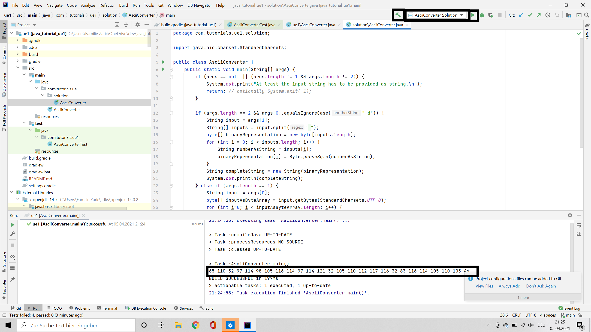
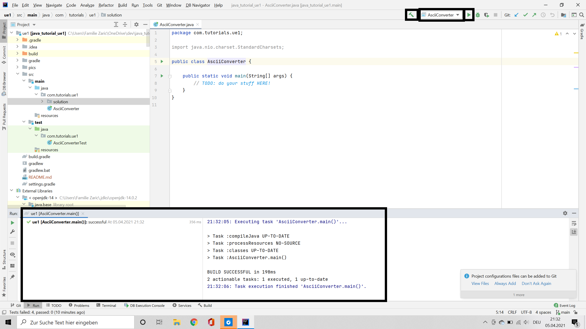
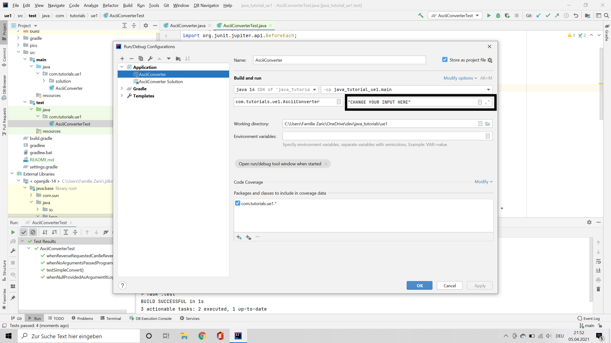
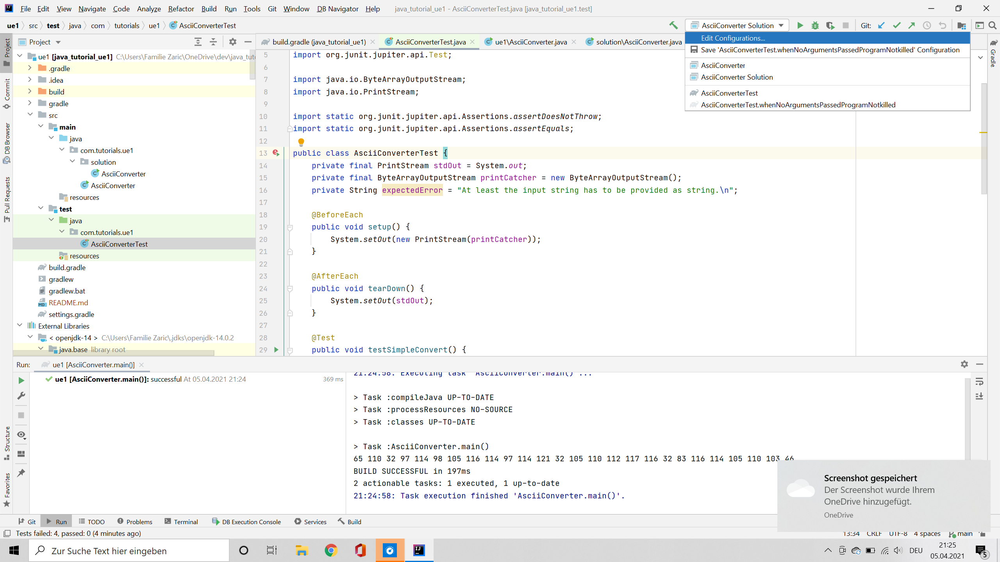
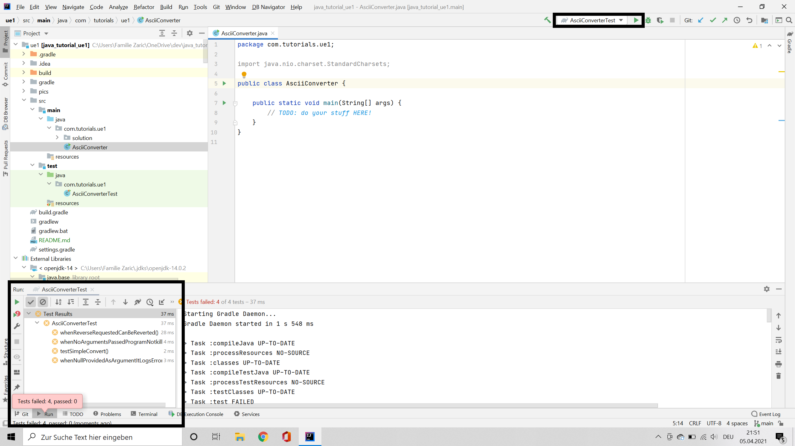
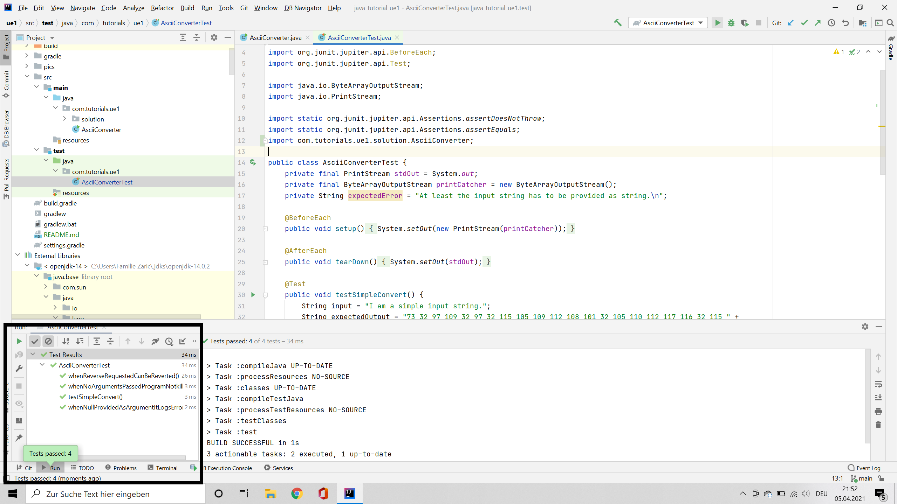

# Übung 1

Ziel dieser übung ist es einen simplen ASCII to decimal und decimal to ascii converter zu schreiben.

Eine ausführung sollte in folgendem Resultieren: 
```
$ asciiConverter "I am a simple input string."
73 32 97 109 32 97 32 115 105 109 112 108 101 32 105 110 112 117 116 32 115 116 114 105 110 103 46

$ asciiConverter -d "73 32 97 109 32 97 32 115 105 109 112 108 101 32 105 110 112 117 116 32 115 116 114 105 110 103 46"
I am a simple input string.
```
Wenn eine ungültige Anzahl an Argument oder "null" provided wird dann sollte folgende meldung erscheinen: "At least the input string has to be provided as string.\n"
``` 
asciiConverter
At least the input string has to be provided as string.
``` 
Die implementation sollte in der vorbereiteten main methode stattfinden.
Zur Überprüfung stehen tests zur Verfügung. 


## Compilen/Ausführen des Programms
Es sollten einge "Run configurations" zur Verfügung stehen. Diese findet man am rechten oberen rand auswählbar durch ein Drop-Down Menü. Des weiteren ist eine Lösung im Package "solution" mit einer dem entsrechenden run config dabei.

Wähle "AsciiConverter" aus und clicke auf das play symbol daneben.


Der input parameter kann editiert werden indem man auf das drop down bei den run configurations clicked und dann "Edit Configurations..." auswählt. Dort gibt es ein input feld für arguments: 


## Ausführen der Tests
Navigiere zur Datei AsciiConverterTest.java (src/test/java/com/tutorials/ue1/) in IntelliJ. Um einen einzelnen Test auszuführen selectier das grüne play symbol am linken rand (neben der zeilennummer) der test definition. Um alle methoden auszuführen selectier das doppelte play symbol am linken rand neben dem Klassennamen "AsciiConverterTest".

Einfacher ist die zur Verfügung gestellte run configuration "AsciiConveterTest".


Zu Beginn sollten alle Tests failen und folgendeds Bild ergeben:


Nach und nach sollten die Tests grün werden und wie folgt zum schluss aussehen:


## What do you need to know?
Well in this example you will...
* have to convert strings to bytes and vice versa. 
* have to access arrays and iterate through them. 
* have to work with programm arguments

I would suggest to look at the following inputs:
* https://www.w3schools.com/java/java_arrays.asp
* https://www.javatpoint.com/java-for-loop#:~:text=The%20Java%20for%20loop%20is,basis%20of%20given%20boolean%20condition.&text=If%20the%20number%20of%20iteration%20is%20not%20fixed%2C%20it,recommended%20to%20use%20while%20loop.
* https://docs.oracle.com/en/java/javase/14/docs/api/java.base/java/lang/Byte.html#parseByte(java.lang.String)
* https://docs.oracle.com/javase/tutorial/essential/environment/cmdLineArgs.html